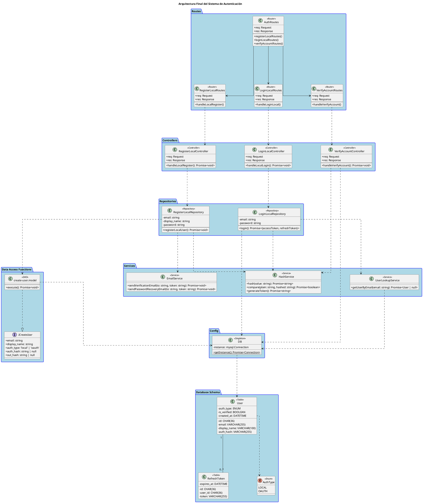

# Proyecto: Sistema de Autenticación

---

## Integrantes del Equipo
* ALEJANDRO JUNCAL PONCE
* ARLETH MISUKI ORTIZ ROQUE
* SAMANTHA DE LA MORA LòPEZ
* DIEGO ARIAS TIRADO
* OLIVER ENRIQUE SUÁREZ MORA
* DANIEL ALEJANDRO ALVAREZ MATA

---

## Descripción del Proyecto
Este proyecto implementa el núcleo de un sistema de autenticación seguro y modular. La arquitectura se centra en tres endpoints clave: registro de nuevos usuarios, inicio de sesión local (email y contraseña) y verificación de la cuenta, demostrando un flujo de trabajo completo y escalable.

---

## Diagrama de Clases (PlantUML)

---
### Explicación del Diagrama de Arquitectura

Este diagrama UML describe una arquitectura de software multicapa para un sistema de autenticación. Cada capa tiene una responsabilidad clara, lo que promueve un código más limpio, mantenible y escalable.

---

#### Capa de Ruteo (Routes)
Es el **punto de entrada** de todas las solicitudes HTTP al sistema.
* **Función**: Su única responsabilidad es recibir las peticiones (`Request`) y dirigirlas al controlador adecuado. No contiene lógica de negocio.
* **Clases**:
    * `AuthRoutes`: Actúa como el enrutador principal que agrupa todas las rutas relacionadas con la autenticación.
    * `RegisterLocalRoutes`, `LoginLocalRoutes`, `VerifyAccountRoutes`, etc.: Son sub-enrutadores que manejan endpoints específicos (ej: `/register`, `/login`) y llaman al método correspondiente en el controlador.
* **Atributos Públicos (`+`)**: Los atributos `req` y `res` son públicos para permitir una fácil integración con el framework subyacente que gestiona el ciclo de vida de las peticiones y respuestas HTTP.

---

#### Capa de Controladores (Controllers)
Esta capa actúa como el **intermediario** entre las rutas y la lógica de negocio.
* **Función**: Extrae la información necesaria de la solicitud (`req`), como el cuerpo (body) o los parámetros. Llama a los repositorios para ejecutar la lógica de negocio y, finalmente, formula y envía la respuesta (`res`) al cliente (por ejemplo, un código 200 con un token JWT, o un 401 si las credenciales son inválidas).
* **Clases**: `RegisterLocalController`, `LoginLocalController`, `VerifyAccountController`.
* **Atributos Públicos (`+`)**: Al igual que en la capa de ruteo, `req` y `res` son públicos para interactuar directamente con el flujo de datos HTTP.

---

#### Capa de Repositorios (Repositories)
Esta capa **orquesta la lógica de negocio**. No ejecuta la lógica directamente, sino que coordina a los servicios y funciones de acceso a datos (DAO) para cumplir con una tarea.
* **Función**: Recibe los datos del controlador (ej: email y contraseña) y los utiliza para llamar a diferentes servicios. Por ejemplo, `RegisterLocalRepository` llamará a `HashService` para encriptar la contraseña, a `"create-user.model"` para guardar el usuario en la base de datos y a `EmailService` para enviar un correo de verificación.
* **Atributos Privados (`-`)**: Los datos sensibles como `email` y `password` son **privados**. Esto significa que solo pueden ser accedidos y manipulados por los métodos de la propia clase, garantizando un alto nivel de encapsulamiento y seguridad.

---

#### Capa de Servicios (Services)
Contiene la **lógica de negocio pura y reutilizable**.
* **Función**: Cada servicio tiene una única responsabilidad bien definida (Principio de Responsabilidad Única). Son componentes aislados y fácilmente testeables.
* **Clases**:
    * `HashService`: Se encarga de todo lo relacionado con criptografía, como hashear contraseñas y compararlas.
    * `EmailService`: Gestiona el envío de correos electrónicos.
    * `UserLookupService`: Proporciona métodos para buscar usuarios en la base de datos.

---

#### Capa de Funciones de Acceso a Datos (DAO)
Es la capa más baja y la única que **interactúa directamente con la base de datos**.
* **Función**: Contiene las funciones que ejecutan las consultas SQL. Por ejemplo, la clase `"create-user.model"` implementa la interfaz `ICreateUser` para definir los datos que necesita y contiene la lógica para ejecutar un `INSERT INTO` en la tabla `User`. Este uso de interfaces asegura que los datos que recibe el DAO siempre tengan una estructura consistente.

---

#### Configuración (Config)
Gestiona la configuración global de la aplicación.
* **Función**: En este caso, la clase `DB` maneja la conexión a la base de datos utilizando un patrón **Singleton**, que asegura que solo exista una única instancia de la conexión en toda la aplicación, optimizando recursos.

---

#### Esquema de la Base de Datos (Database Schema)
Representa la **estructura de las tablas** en la base de datos.
* **Función**: Sirve como una referencia visual de cómo se almacenan los datos, incluyendo las tablas (`User`, `RefreshToken`), sus columnas y las relaciones entre ellas.

---

### ¿Por qué `public`, `protected` y `private`? (Visibilidad)

La visibilidad (`+`, `#`, `-`) define qué tan accesible es un atributo o método desde otras partes del código. Elegir la correcta es clave para un diseño seguro y robusto.

* **Privado (`-`)**: Es el nivel **más restrictivo**. Un miembro privado solo puede ser accedido desde **dentro de la misma clase**.
    * **¿Por qué se usa aquí?**: En los `Repositories`, los atributos como `email` y `password` son privados. Esto es fundamental para la **encapsulación** y la **seguridad**. Ninguna otra clase puede leer o modificar directamente la contraseña de un usuario.

* **Protegido (`#`)**: Es un nivel **intermedio**. Un miembro protegido puede ser accedido desde **dentro de la misma clase y por cualquier clase que herede de ella (subclases)**. Aunque no se utiliza en este diagrama, es una herramienta útil para crear clases base que pueden ser extendidas de forma controlada.

* **Público (`+`)**: Es el nivel **más permisivo**. Un miembro público puede ser accedido desde **cualquier parte del código**.
    * **¿Por qué se usa aquí?**: Los atributos `req` y `res`, los métodos de los controladores como `handleLocalRegister()`, y los miembros de la interfaz `ICreateUser` son públicos. Estos forman la **"API pública"** de las clases, permitiendo la comunicación y el paso de datos esenciales entre las distintas capas.

---

### Relaciones y Flujos entre Clases

Las flechas y líneas en el diagrama definen cómo interactúan las clases y cómo fluye la información.

* **Dependencia (`..>` y `-->`)**: La flecha punteada o sólida con punta abierta indica que una clase **usa** a otra. La clase de origen necesita una instancia de la clase de destino para poder funcionar.
    * **Ejemplo de Flujo (Registro)**:
        1.  `AuthRoutes --> RegisterLocalRoutes`: El enrutador principal delega la petición al enrutador específico.
        2.  `RegisterLocalRoutes ..> RegisterLocalController`: El enrutador de registro llama al método del controlador.
        3.  `RegisterLocalController ..> RegisterLocalRepository`: El controlador pasa los datos al repositorio para que orqueste la operación.
        4.  `RegisterLocalRepository ..> HashService`, `EmailService`, `"create-user.model"`: El repositorio **usa** múltiples servicios y DAOs para cumplir su tarea.

* **Asociación (`--`)**: La línea sólida sin flecha entre `User` y `RefreshToken` indica una **relación estructural** a largo plazo.
    * **Significado**: Un objeto `User` está conectado con cero o muchos objetos `RefreshToken`. Esto se traduce en una relación de clave foránea en la base de datos.

* **Implementación (`..|>`)**: La flecha punteada con un triángulo hueco (de `"create-user.model"` a `ICreateUser`) indica que una clase **implementa** una interfaz. La clase se compromete a proporcionar una implementación para todos los miembros definidos en la interfaz, asegurando un "contrato" de estructura.